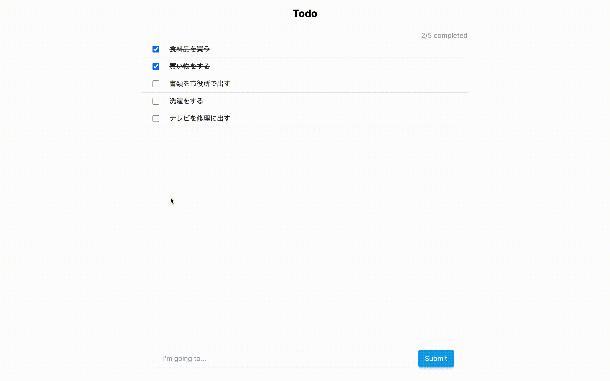

# Omikuji Todo



## Running locally

### Start gRPC backend

```shell
sbt run
```

### Start GraphQL BFF

```shell
dotnet run
```

### Start Next.js frontend

```
pnpm i
pnpm build
pnpm start
```

## Tech stack

### Server

- Scala
- gRPC
- Akka ([Official site](https://akka.io/))

### BFF

- C#
- .NET
- GraphQL
- Hot Chocolate ([Official site](https://chillicream.com/docs/hotchocolate/v13))

### Frontend

- TypeScript
- React
- Next.js ([Official site](https://nextjs.org/))
- nitrogql ([Official site](https://nitrogql.vercel.app/))
